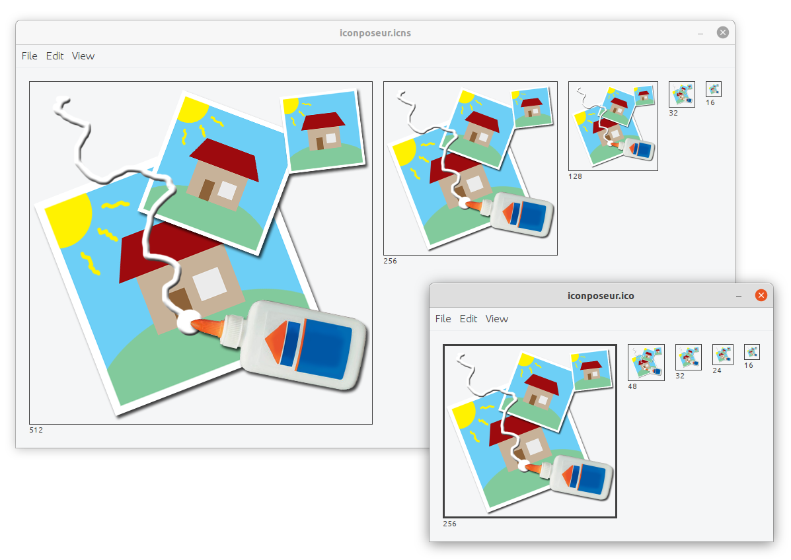
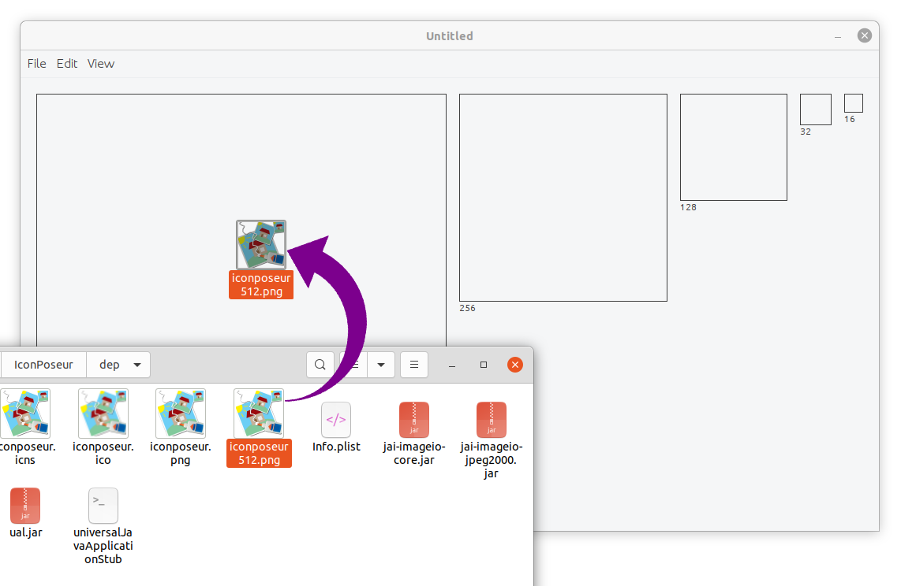
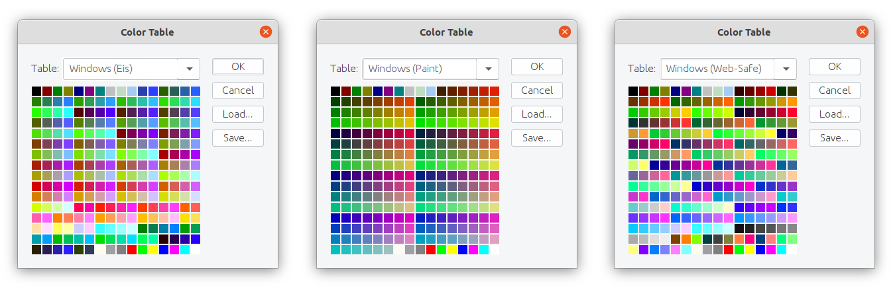

# Icon Poseur

Open-source recreation of the Icon Composer application. Create icons for Mac OS X without Xcode. Also creates Windows ico files.

Drag and drop images or image files into the icon window to create your icon. Or select a size and copy and paste.

Multiple views allow access to all sizes and color depths of icons, including retina, 8-bit, 4-bit, and black and white versions.

For 8-bit Windows icons, the color table is user-selectable. Color tables can be loaded from or saved to ACT or BMP files.

